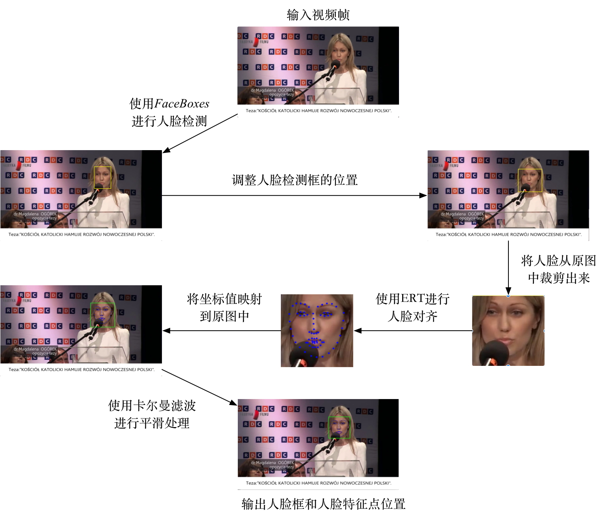
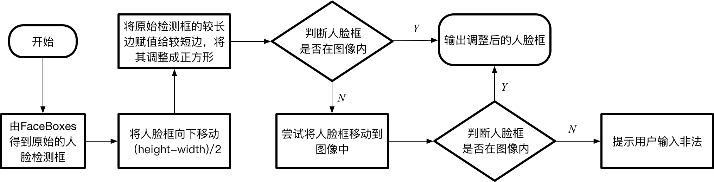
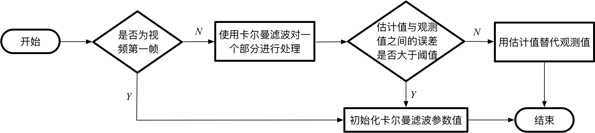

# 人脸检测和人脸对齐C++工程

## 1、前言
该工程分为人脸检测，人脸对齐和特征点平滑处理三个部分。

**人脸检测**

采用FaceBoxes作为解决方案，参考论文《FaceBoxes: A CPU Real-time Face Detector with High Accuracy》。并且在该论文提出的网络结构基础上，进行了网络压缩，使其达到更快的速度，详情见model文件夹中的README.md

**人脸对齐**

采用dlib库中的ERT作为解决方案，参考论文《One Millisecond Face Alignment with an Ensemble of Regression Trees》

**特征点平滑处理**

由于使用ERT进行视频帧的特征点检测时，特征点会出现明显的抖动，所以采用卡尔曼滤波进行平滑处理，参考论文《Automatic facial landmark tracking in video sequences using kalman filter assisted active shape models》

## 2、流程说明

**总体流程**



**调整人脸检测框流程**

在上述流程中，由于检测算法得到的人脸框普遍无法将所有的68个人脸特征点包含进来，因此引入调整人脸检测框位置这一步，具体步骤如下图所示：



**卡尔曼滤波处理流程**

卡尔曼滤波分别针对68个特征点中嘴部、眼睛、面部轮廓和其他区域4个部分进行滤波，这四个部分的原理相同，只是参数的设置不同。以其中一个为例，如下图所示：



## 3、依赖环境
* FaceBoxes caffe环境
* dlib 19.15
* Opencv 3.1.0
* CentOS Linux release 7.2

## 4、API
**类说明**

```
FacenetCaffe
```

* 该类用于封装人脸检测的功能函数


```
FaceLandmarkDetector
```
* 该类用于封装人脸特征点检测的功能函数

**函数说明**

**class FacenetCaffe**

```
int initModel(const string & model_path, const string & weights_path, const string & mean_value)
```

参数

* model_path —— 网络模型路径
* weights_path —— 网络权重路径
* mean_value —— 图像均值

返回值

* int类型，用于返回错误码，可根据实际情况进行修改

作用

* 初始化人脸检测模型

```
vector<vector<float>> detectFace(const cv::Mat & img)
```

参数

* img —— 待检测图片

返回值

* 检测到人脸的坐标值

作用

* 检测img中人脸坐标值

**class FaceLandmarkDetector**

```
void init(const string model_path)
```

参数

* model_path —— ERT模型路径

返回值

* 空

作用

* 初始化ERT模型和卡尔曼滤波参数


```
int GetFaceBox(FacenetCaffe fc_box, cv::Mat image, std::vector<std::vector<int>> & face_box, float confidence_threshold, double & time_detec)
```

参数

* fc_box —— FacenetCaffe类的对象
* image —— 待检测人脸框的图像
* face_box —— 检测出来的人脸框
* confidence_threshold —— 置信度阈值
* time_detec —— 检测时间

返回值

* int类型，用于返回错误码，可根据实际情况进行修改

作用

* 利用类FacenetCaffe中的detectFace方法检测图片的人脸框位置，并计算检测时间

```
int AdjustFaceBox(cv::Mat image, std::vector<std::vector<int>> & face_box)
```

参数

* image —— 待检测人脸框的图像
* face_box —— 由GetFaceBox检测出来的人脸框

返回值

* int类型，用于返回错误码，可根据实际情况进行修改

作用

* 根据上面第二部分的流程说明中”调整人脸检测框流程“的步骤对GetFaceBox检测出来的人脸框进行调整，使其可以包含所有的人脸特征点

```
int ImageStandard(float & rate_w, float & rate_h, cv::Mat frame, std::vector<std::vector<int>> face_box, std::vector<cv::Mat> & img_resize_vector)
```

参数

* rate_w —— 缩放人脸框的x轴方向比例
* rate_h —— 缩放人脸框的y轴方向比例
* frame —— 待检测人脸框的图像
* face_box —— 经过AdjustFaceBox调整过后的人脸检测框
* img\_resize\_vector —— 存储根据上面人脸检测框crop出来的人脸图片

返回值

* int类型，用于返回错误码，可根据实际情况进行修改

作用

* 为了达到更高的精度，ERT检测人脸特征点需要224x224的纯人脸图像，所以要根据上面得到的人脸框将人脸从原图中crop出来，并将其resize到224x224大小。而由于后面需要将这些点重新映射到原图上，所以需要rate\_w和rate\_h来保存缩放比例

```
int detectFaceLandmark(float & rate_w, float & rate_h, std::vector<int> face_box, cv::Mat image, std::vector<std::vector<int>> & landmark, bool flag, double & time)
```
参数

* rate_w —— 缩放人脸框的x轴方向比例
* rate_h —— 缩放人脸框的y轴方向比例
* face_box —— 经过AdjustFaceBox调整过后的人脸检测框
* image —— 根据人脸检测框crop出来的人脸图片
* landmark —— 检测出来的特征点，是一个68x2的二维vector
* flag —— 是否需要使用滤波处理
* time —— 检测特征点所需时间

返回值

* int类型，用于返回错误码，可根据实际情况进行修改

作用

* 检测根据人脸检测框crop出来的人脸图片中对应的人脸特征点，并将其坐标映射回原图中。如果flag为True，则将该预测出来的特征点进行滤波平滑处理。

```
void GetNewPoints(float rate_w, float rate_h, std::vector<int> face_box, std::vector<std::vector<int>> & landmark_pre, std::vector<std::vector<int>> & landmark_pre_ori)
```

参数

* rate_w —— 缩放人脸框的x轴方向比例
* rate_h —— 缩放人脸框的y轴方向比例
* face_box —— 经过AdjustFaceBox调整过后的人脸检测框
* landmark_pre —— 利用ERT检测crop之后的人脸所得到的特征点
* landmark\_pre\_ori —— 将landmark_pre映射到原始输入图像中得到的特征点

返回值

* 空

作用

* 实现detectFaceLandmark函数中将ERT检测crop之后的人脸所得到的特征点映射到原始输入图像的功能

```
std::vector<std::vector<int>> KalmanFilter(cv::Mat landmark_pre, float height)
```

参数

* landmark_pre —— 对于detectFaceLandmark中ERT方法得到的原始图像中的特征点坐标值，将其转换为cv::Mat形式，并将其进行转置为一个68x2的矩阵
* height —— 检测出来的人脸框的高

返回值

* landmark_pre经过卡尔曼滤波处理后得到的新的特征点坐标值

作用

* 根据上面第二部分的流程说明中”卡尔曼滤波处理流程“对ERT检测到的特征点进行平滑处理

```
void drawLandmarks(cv::Mat &image, std::vector<std::vector<int>> landmark, cv::Scalar color = cv::Scalar(255, 0, 0), int radius = 3)
```

参数

* image —— 输入的原始待检测图片
* landmark —— 特征点坐标值
* color —— 在输入图片上画特征点的颜色
* radius —— 在输入图片上画特征点的半径值

返回值

* 空

作用

* 将检测到的特征点画到输入图片上

```
void TestVedioLandmark(FacenetCaffe fc_box, const string root)
```

参数

* fc_box —— FacenetCaffe类的对象
* root —— 存放示例视频及其对应标签的根目录

返回值

* 空

作用

* 检测示例视频中的人脸位置以及人脸特征点，主函数可以仿照这个函数来写


## 5、Quick Start

* 拷贝整个工程文件

```
git clone http://git.code.com/camlinzhang/face_detection_and_alignment.git
```

* 修改CMakeList.txt

（1）编译动态库

```
set(SOURCE_FILES src/face_landmark_detection.cpp include/face_landmark_detection.h src/facenet_caffe.cpp include/facenet_caffe.h include/caffe_register.h)

......

#add_executable(face_landmark ${SOURCE_FILES})

ADD_LIBRARY(face_landmark SHARED ${SOURCE_FILES})
SET(LIBRARY_OUTPUT_PATH ${PROJECT_SOURCE_DIR})

target_link_libraries(face_landmark ${olibs_point} ${bLIBS} ${oLIBS} ${hLIBS} dlib caffe glog gflags protobuf openblas opencv_core opencv_imgproc opencv_highgui opencv_imgcodecs)
```

（2）编译静态库

```
set(SOURCE_FILES src/face_landmark_detection.cpp include/face_landmark_detection.h src/facenet_caffe.cpp include/facenet_caffe.h include/caffe_register.h)

......


#add_executable(face_landmark ${SOURCE_FILES})

ADD_LIBRARY(face_landmark ${SOURCE_FILES})
SET(LIBRARY_OUTPUT_PATH ${PROJECT_SOURCE_DIR})

target_link_libraries(face_landmark ${olibs_point} ${bLIBS} ${oLIBS} ${hLIBS} dlib caffe glog gflags protobuf openblas opencv_core opencv_imgproc opencv_highgui opencv_imgcodecs)
```

（3）编译可执行文件，用于测试

```
set(SOURCE_FILES src/main.cpp src/face_landmark_detection.cpp include/face_landmark_detection.h src/facenet_caffe.cpp include/facenet_caffe.h include/caffe_register.h)

......

add_executable(face_landmark ${SOURCE_FILES})

#ADD_LIBRARY(face_landmark SHARED ${SOURCE_FILES})
#SET(LIBRARY_OUTPUT_PATH ${PROJECT_SOURCE_DIR})

target_link_libraries(face_landmark ${olibs_point} ${bLIBS} ${oLIBS} ${hLIBS} dlib caffe glog gflags protobuf openblas opencv_core opencv_imgproc opencv_highgui opencv_imgcodecs)
```


* 进入工程文件并编译

```
cd face_detection_and_alignment
mkdir build
cd build
cmake ..
make -j8
```

* 最后

（1）执行可执行文件进行测试(当修改CMakeList.txt用于编译可执行文件进行测试时)

```
./face_landmark
```
（2）在工程的根目录下生成库文件(当修改CMakeList.txt用于生成库文件时)