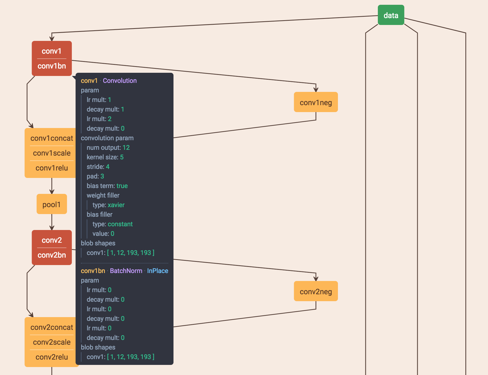
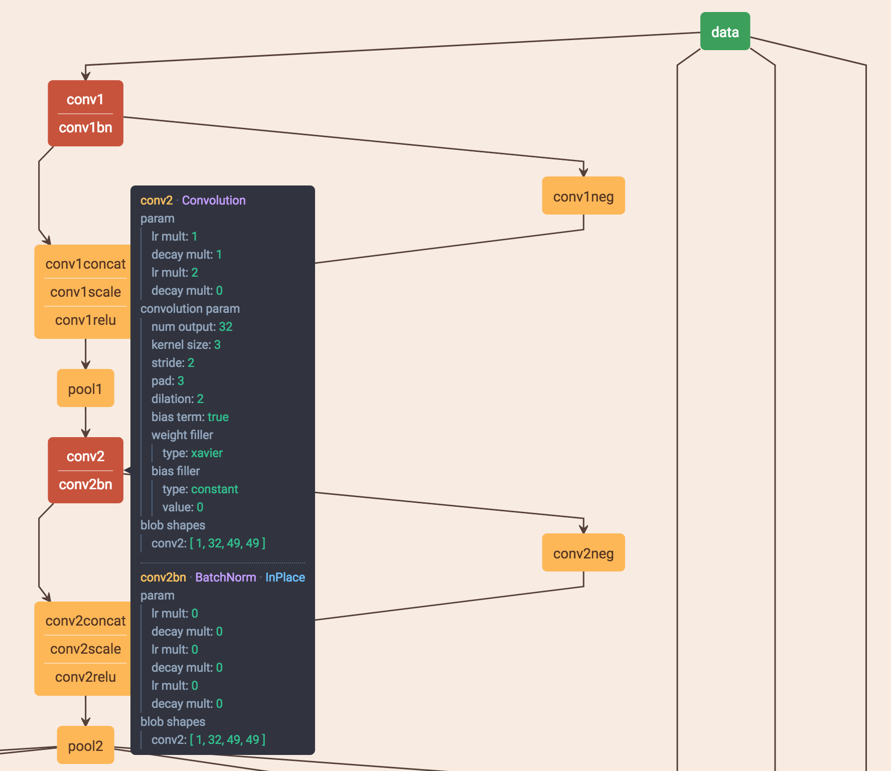

#人脸检测模型
-

### 模型使用

**faceboxes_official**

* 该版本为该[Github](https://github.com/zeusees/FaceBoxes)地址下复现论文《FaceBoxes: A CPU Real-time Face Detector with High Accuracy》的预训练版本

**faceboxes_0718**

* 该版本为faceboxes\_official的压缩版本，支持各种通用场景以及老年人和身份证人脸检测
* 输入分辨率为768x768
* 内测中人脸置信度建议阈值，优先为0.7。如果实战测试中发现漏检影响结果，建议将阈值调为0.6
* 时间上相较于faceboxes\_official要更快

**faceboxes_0724**

* 该版本模型为faceboxes\_official的压缩版本,支持老年人人脸检测的模型
* 输入分辨率为512x512
* 该版本阈值及时间情况由于没有具体应用场景，没有进行测试

**faceboxes_0822**

* 该版本为faceboxes\_official的压缩版本，支持各种通用场景以及老年人和身份证人脸检测
* 输入分辨率为768x768
* 内测中人脸置信度建议阈值，优先为0.8。如果实战测试中发现漏检影响结果，建议将阈值调为0.7
* 时间上相较于faceboxes\_0718速度要进一步提高，并且精度上略有提升(可以参考后面的测试得到的对比表格)

### 模型压缩说明

**压缩方法**

上面的模型压缩以时间顺序为一个递进的过程，最后得到的faceboxes_0822是本人压缩得到的一个最好的模型，主要压缩的思路如下：

通过对各个层的时间进行测试后，发现整个网络结构中conv1和conv2消耗的时间最长，占了总时间的40%左右，所以压缩工作主要集中在前面两个卷积层上

（1）将第一个卷积层的kernel size由原始网络的7x7调整为5x5，其他参数不变，具体参数如下图所示：

（2）将第二个卷积层的kernel size由原始网络的5x5调整为3x3，并设置其dilation为2，即将其设置为一个带孔卷积，具体参数如下图所示：

**测试结果**

1、测试集：

* 老人脸数据：1094张
* AFLW数据：1043张
* 证件照：100张

2、测试指标(由于工作要求是在faceboxes\_0718的基础上进行压缩，所以下表将本人压缩的模型faceboxes\_0822与之进行比较)：

* confidence = 0.7, IOU = 0.7

model name     | average time | F1 score | Recall | Precision
:------------: | :----------: | :------: | :----: | :-------:
faceboxes\_0718|     103      |  85.46   |  87.21 |  84.57
faceboxes\_0822|      84      |  86.88   |  87.5  |  85.26

* confidence = 0.8, IOU = 0.8

model name     | average time | F1 score | Recall | Precision
:------------: | :----------: | :------: | :----: | :-------:
faceboxes\_0718|     101      |  84.34   |  85.2  |  84.72
faceboxes\_0822|     83       |  85.67   |  85.28 |  86.06

### 模型压缩下一步工作

* 针对前面两个卷积层，在前面的工作中尝试了两层都使用带孔卷积以及只将第一层卷积减少到5x5或者只将第二层卷积减少到3x3的方法，但经过测试发现上面这种组合方式可以在最大程度减小时间的基础上保证精度要求，下一步工作可以参考论文《SqueezeNet：AlexNet-level accuracy with 50x fewer parameters and <0.5MB》中的方法进行压缩，将7x7和5x5的两个卷积核进行类似inception的进行分解，来进一步降低时间

* 中间的inception部分，论文中的网络模型是采用v3的形式，可以考虑使用v4的形式，将3x3的卷积核进一步拆解为3x1和1x3的形式

* 对于最后的anchor部分，可以根据具体的实践需求进行调整，比如如果实践中不需要检测过小的人脸，则可以将anchor的scale大小进一步增大来减少计算量

#人脸特征点检测模型
-

### 模型使用

**predictor.dat**

* 使用faceboxes_0718检测到的人脸检测框进行训练得到的模型，在精度上和faceboxes_0718进行搭配使用可以达到最好的效果

**predictor_official.dat**

* 该模型是官方网站[dlib](http://dlib.net/files/)里下载的官方预训练模型
